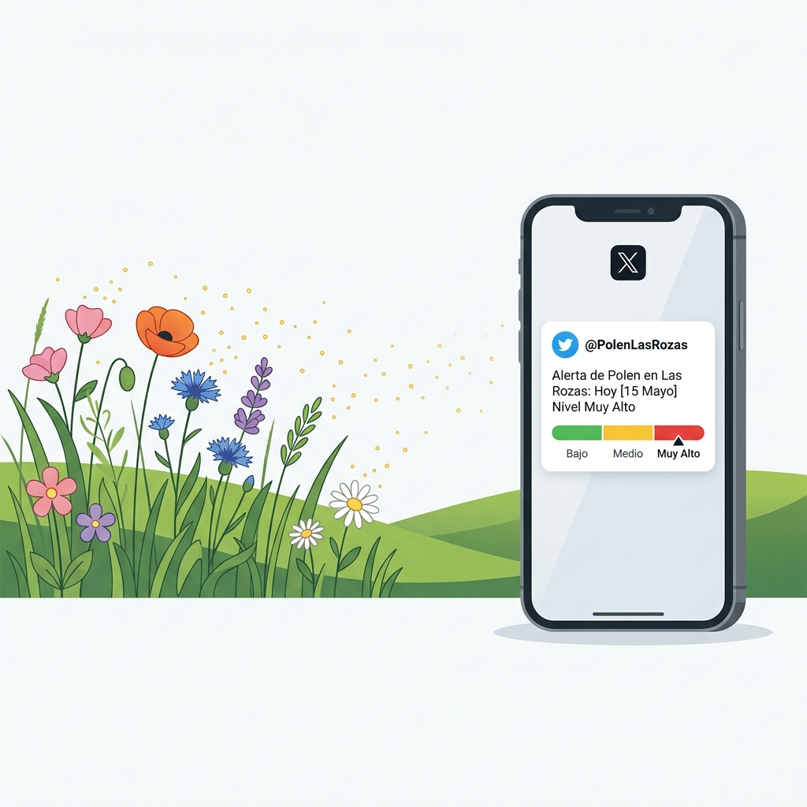

# Polen 🌿



Automated Twitter/X bots that monitor pollen levels in Spain and tweet whenever new data is published.

| Bot | Location | Source |
|-----|----------|--------|
| [@PolenLasRozas](https://twitter.com/PolenLasRozas) | Las Rozas, Madrid | [datos.comunidad.madrid](https://datos.comunidad.madrid/catalogo/dataset/e608aace-3593-43a3-8c91-02332137fa83) CKAN API |
| [@PolenAvila](https://twitter.com/PolenAvila) | Ávila | [opendata.jcyl.es](https://opendata.jcyl.es/ficheros/inpo/polen_actual.xml) XML feed |

## How it works

Each script:
1. Fetches the latest pollen readings from its data source
2. Compares with the last posted date — exits silently if nothing changed
3. Builds a tweet with each pollen type, its grain count, and a color-coded level icon
4. Posts as a thread if the content exceeds 280 characters

Pollen levels follow REA thresholds:

| Level | Grains/m³ | Icon |
|-------|-----------|------|
| Low | < 10 | 🟢 |
| Medium | 10–49 | 🟡 |
| High | 50–199 | 🟠 |
| Very high | ≥ 200 | 🔴 |

Zero readings are omitted from the tweet.

## Setup

```bash
python3 -m venv .venv
source .venv/bin/activate
pip install -r requirements.txt
cp env.example .env
# fill in your Twitter API credentials in .env
```

## Configuration

Copy `env.example` to `.env` and fill in the values:

```env
# Las Rozas
CONSUMER_KEY_LASROZAS=...
CONSUMER_SECRET_LASROZAS=...
ACCESS_TOKEN_LASROZAS=...
ACCESS_TOKEN_SECRET_LASROZAS=...
CAPTADOR_LASROZAS=ROZA

# Ávila
CONSUMER_KEY_AVILA=...
CONSUMER_SECRET_AVILA=...
ACCESS_TOKEN_AVILA=...
ACCESS_TOKEN_SECRET_AVILA=...
POLEN_URL_AVILA=https://opendata.jcyl.es/ficheros/inpo/polen_actual.xml
```

Twitter API credentials require a [developer account](https://developer.twitter.com) with an app inside a **Project** (Pay Per Use tier).

## Running

```bash
python3 polen_lasrozas.py
python3 polen_avila.py
```

Intended to run daily via cron:

```cron
0 10 * * * cd /path/to/polen && .venv/bin/python3 polen_lasrozas.py
0 10 * * * cd /path/to/polen && .venv/bin/python3 polen_avila.py
```

## Project structure

```
polen_lib.py        # shared: Twitter client, dupe detection, tweet threading, level classification
polen_lasrozas.py   # Las Rozas bot
polen_avila.py      # Ávila bot
```
